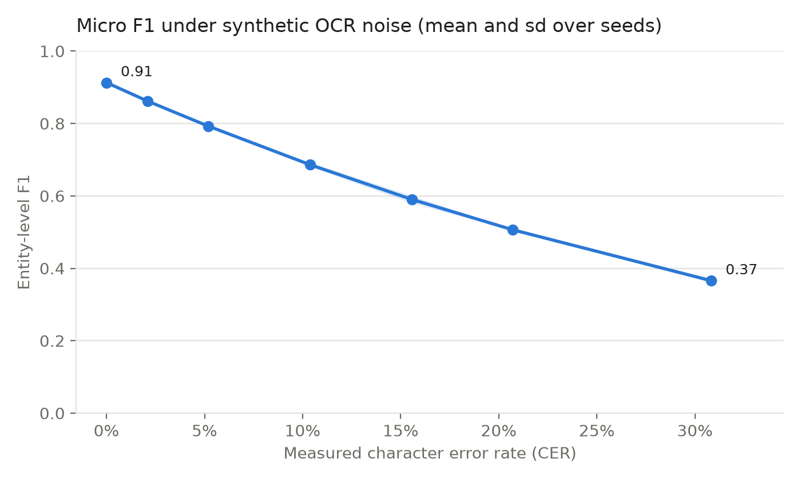
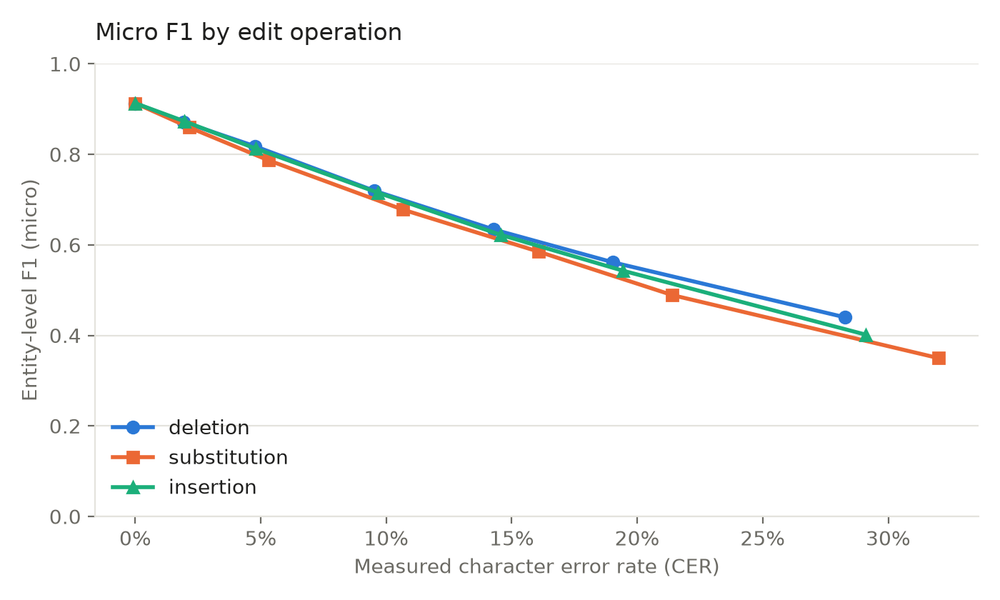
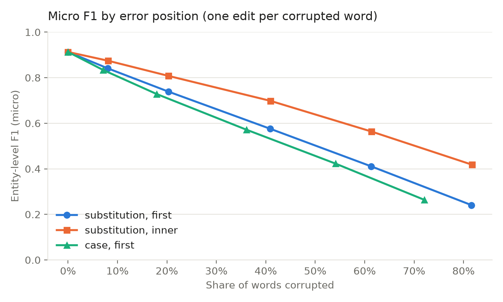
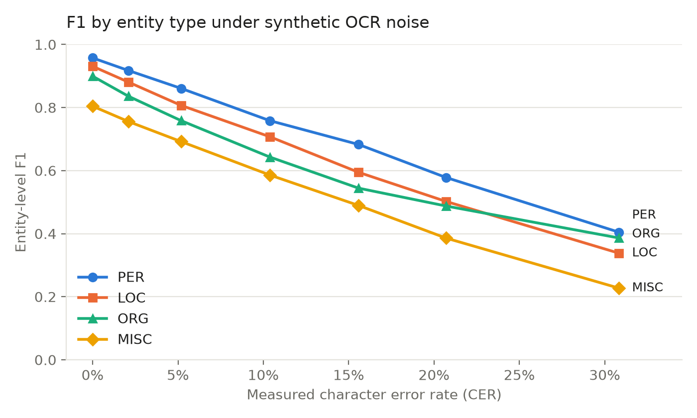

# How robust is transformer-based NER to OCR errors?

Controlled experiments measuring how character-level OCR errors degrade a
pre-trained transformer model for named entity recognition (NER), and which
kinds of errors matter most.

## Background

Digitised historical archives are read through OCR and HTR, and their output is
noisy. Named entities (people, places, organisations) are the anchor points for
searching and linking these documents, so any downstream analysis depends on how
robust entity extraction is to that noise.

Prior work has shown that OCR errors substantially degrade NER. On CoNLL-2003
[4] rendered as degraded images and read back with an OCR engine, a
BiLSTM-CNN-CRF model [2] trained on clean text drops from **90.90** micro F1 on
clean text to **87.45** at a character error rate (CER) of 1.7%, **70.82** at
6.9% and **60.31** at 41.3% [1]. Analysing the errors produced by the OCR
engine, the same study reports that:

- among entities hit by a single error, **deletions are handled well** (79.5%
  still correctly recognised), unlike substitutions and insertions;
- **errors on the first character are very damaging**: only 30.41% of the
  affected entities are still correctly recognised;
- segmentation errors (merged or split words) have a very strong impact.

These observations come from the errors a real OCR engine happened to make. This
project asks whether they hold for a transformer model [3], and tests them under
controlled noise: each factor (edit operation, error position) is varied while
everything else stays fixed.

## Research questions

1. **Overall robustness.** How much does a pre-trained transformer
   (`dslim/bert-base-NER`) degrade as the CER increases, compared with the
   figures reported for a BiLSTM-CNN-CRF model [1]?
2. **Edit operations.** At equal CER, do deletions hurt less than substitutions
   and insertions?
3. **Error position.** With one edit per corrupted word, does an error on the
   first character hurt more than the same error elsewhere in the word? Does a
   simple case change of the first letter (Paris to paris) suffice?
4. **Entity types.** Are persons, locations and organisations equally fragile?

## Method

**Corpus and model.** CoNLL-2003 English test split [4], with
`dslim/bert-base-NER` used as is (inference only, trained on clean text). A
French preset (WikiANN, `Jean-Baptiste/camembert-ner`) is also available with
`--preset fr`.

**Noise model** (`noise.py`), controlled by two options:

| Option | Values | Meaning |
|---|---|---|
| `--edit-type` | `mixed`, `substitution`, `deletion`, `insertion`, `case` | which operations are applied. `mixed` combines visually plausible confusions (`rn` to `m`, `l` to `1`, `e` to `c`, long s), random substitutions, deletions and insertions |
| `--position` | `any`, `first`, `inner` | `any`: every character can be edited. `first` / `inner`: a corrupted word receives exactly one edit, on its first character or on another one |

With the same seed, `first` and `inner` corrupt exactly the same words, so the
two conditions form a paired comparison where only the position changes.
Punctuation-only tokens are never corrupted. The reported CER is measured with
the Levenshtein distance.

**Design choice.** Noise never creates or removes a word boundary, so gold
labels stay aligned with the noisy words. Segmentation errors are therefore not
simulated (see Limitations).

**Evaluation** (`labels.py`). Entity-level precision, recall and F1 with exact
match on span and type, as in CoNLL. Gold and predicted tags are normalised to
IOB2 first. Each word takes the prediction of its first sub-token. Every noise
level is run with 3 seeds; figures show means (and standard deviations for the
main curve).

## Reproduce

```bash
python -m venv .venv && source .venv/bin/activate
pip install -r requirements.txt

python -m unittest discover tests   # checks, no download needed
bash run_all.sh 200                 # every experiment on 200 sentences: a quick check
bash run_all.sh                     # every experiment on the full test split
```

`run_all.sh` runs each experiment with `run_experiment.py` and draws the
figures with `plot_results.py` and `plot_compare.py`. All outputs go to
`results/`: one CSV per experiment (one row per noise level and seed), figures,
a Markdown summary table and noisy example sentences.

## Key findings

- On clean text the model reaches 0.913 micro F1. With 5% of characters
  corrupted it drops to 0.793, and to 0.366 at 31%.
- At the noise level of the mixed OCR degradations reported in [1] (CER 6.9%,
  about 23% of words affected), the transformer keeps 0.758 micro F1, against
  0.708 for the BiLSTM-CNN-CRF. At heavy noise, however, the synthetic setting
  here is much harsher than real OCR output.
- **Errors on the first character are the most damaging**: at equal share of
  corrupted words, a substitution on the first character costs 7 to 17 F1
  points more than the same substitution elsewhere in the word.
- **Losing the capital letter alone is enough**: flipping the case of the first
  letter hurts even more than a substitution, and when every first letter is
  flipped, only 7% of person names are still found.
- Deletions hurt slightly less than insertions, which hurt slightly less than
  substitutions, but the gap is small (2 to 4 F1 points).
- Noise makes the model **miss locations** (high precision, collapsing recall)
  but **invent organisations** (collapsing precision): garbled tokens tend to be
  tagged as ORG.

## Results

All figures are means over 3 seeds on the full CoNLL-2003 test split. Standard
deviations never exceed 0.011 F1, so differences of a few points are stable.
Values marked "interpolated" are read on the curves at a common x value, so that
conditions are compared at equal noise.

### Q1. Overall degradation

| Edit rate | Measured CER | Words changed | Micro F1 (mean ± sd) | PER F1 | LOC F1 | ORG F1 | MISC F1 |
|---|---|---|---|---|---|---|---|
| 0.00 | 0.0% | 0.0% | 0.913 ± 0.000 | 0.957 | 0.931 | 0.899 | 0.804 |
| 0.02 | 2.1% | 7.9% | 0.862 ± 0.003 | 0.917 | 0.881 | 0.836 | 0.756 |
| 0.05 | 5.2% | 18.1% | 0.793 ± 0.001 | 0.861 | 0.807 | 0.759 | 0.692 |
| 0.10 | 10.4% | 32.4% | 0.686 ± 0.005 | 0.758 | 0.707 | 0.643 | 0.586 |
| 0.15 | 15.6% | 43.6% | 0.590 ± 0.010 | 0.683 | 0.595 | 0.544 | 0.489 |
| 0.20 | 20.7% | 52.3% | 0.506 ± 0.001 | 0.578 | 0.502 | 0.488 | 0.386 |
| 0.30 | 30.8% | 64.3% | 0.366 ± 0.005 | 0.405 | 0.338 | 0.386 | 0.227 |



Comparison with the figures reported for a BiLSTM-CNN-CRF on real OCR output
[1]. The transformer values are interpolated at the same CER, and at the same
share of corrupted words (the word error rate, WER, in [1]):

| OCR condition in [1] | CER / WER | BiLSTM-CNN-CRF [1] | Transformer, same CER | Transformer, same share of words |
|---|---|---|---|---|
| Clean text | 0% / 0% | 0.909 | 0.913 | 0.913 |
| Clean images, re-OCRed (LEV-0) | 1.7% / 8.5% | 0.875 | 0.871 | 0.858 |
| Mixed degradations (LEV-MIX) | 6.9% / 22.8% | 0.708 | 0.758 | 0.758 |
| Heavy blurring (Blur LEV-2) | 41.3% / 54.0% | 0.603 | beyond the tested range (0.366 at 31%) | 0.486 |

### Q2. Edit operations

| CER (interpolated) | Deletion | Insertion | Substitution |
|---|---|---|---|
| 5% | 0.813 | 0.809 | 0.794 |
| 10% | 0.711 | 0.709 | 0.691 |
| 20% | 0.549 | 0.535 | 0.514 |
| 28% | 0.444 | 0.418 | 0.402 |



### Q3. Error position

One edit per corrupted word; `first` and `inner` corrupt exactly the same words.

| Words corrupted (interpolated) | Substitution, first character | Substitution, other character | Case flip, first character |
|---|---|---|---|
| 20% | 0.741 | 0.809 | 0.710 |
| 40% | 0.583 | 0.703 | 0.539 |
| 60% | 0.421 | 0.573 | 0.371 |
| 72% | 0.321 | 0.488 | 0.264 |

With every eligible first letter flipped (72% of words), recall falls to 0.07
for PER, 0.24 for LOC and 0.31 for ORG.



### Q4. Entity types



Precision and recall under mixed noise:

| CER | LOC precision | LOC recall | ORG precision | ORG recall | PER precision | PER recall |
|---|---|---|---|---|---|---|
| 0% | 0.93 | 0.93 | 0.89 | 0.91 | 0.96 | 0.96 |
| 10% | 0.84 | 0.61 | 0.55 | 0.77 | 0.74 | 0.77 |
| 31% | 0.69 | 0.22 | 0.32 | 0.48 | 0.50 | 0.34 |

## Discussion

**Q1.** At low noise the transformer behaves like the BiLSTM-CNN-CRF, and at
moderate noise it holds up better (0.758 against 0.708 at the LEV-MIX level),
which is consistent with the robustness usually attributed to sub-word
representations. At heavy noise the picture reverses: the synthetic setting is
much harsher than heavily blurred real OCR, even when compared at the same share
of corrupted words (0.486 against 0.603). Two explanations are likely. First,
errors here are spread uniformly over all words, whereas real OCR errors are
correlated and concentrated, so the same CER leaves more words intact. Second,
real OCR errors are visually constrained and may spare the shapes that matter,
such as capital letters. CER alone is therefore not enough to describe a noise
level: how errors are distributed matters as much as how many there are. Since
models, noise and pipelines all differ, this comparison is an indication, not a
controlled result.

**Q2.** The ordering reported in [1] is reproduced (deletions least harmful,
substitutions most harmful), but the differences are small. A possible reason is
that WordPiece splits a damaged word into several pieces: a word missing one
letter often keeps recognisable pieces, while a substituted character creates
unusual pieces. Insertions were not clearly worse than deletions here, unlike in
[1], where the analysis covered only entities hit by a single real OCR error.

**Q3.** The position effect is the strongest result. Because the same words are
corrupted in both conditions, the gap between first and inner errors can only
come from the position. The case-flip condition shows that capitalisation alone
drives much of it: `dslim/bert-base-NER` is a cased model and relies heavily on
capital letters to detect entities, especially person names. This matches the
observation in [1] that first-character errors are critical, and isolates its
main cause. For historical documents, where OCR often confuses capitals and
lowercase letters, correcting the case of the first letter looks like a cheap
and effective post-OCR step.

**Q4.** Persons are the most robust type throughout, probably because they come
with strong context cues (titles, first name and surname patterns, reporting
verbs). MISC is always the weakest, as on clean text. Locations and
organisations fail in opposite ways. For LOC, precision stays high while recall
collapses: the model stops recognising damaged place names, which it probably
identifies largely from their surface form. For ORG, precision collapses: the
model tags garbled tokens as organisations, maybe because unfamiliar strings
look like acronyms or company names. OCR noise therefore does not only remove
entities, it also creates false ones.

## Limitations

- Synthetic noise is not real OCR noise: real errors are correlated (a degraded
  line, a font, a damaged page) whereas here they are independent.
- No segmentation errors, by design, although they strongly affect NER [1].
- The comparison with previously reported figures is indirect: different model,
  different noise and a different pipeline.
- Modern newswire text, not historical documents: language drift, spelling
  variation and period-specific entities are not covered.

## Possible extensions

- Evaluate the transformer on the noisy OCRed version of CoNLL-2003 released
  with [1] (https://zenodo.org/record/3877554), for a direct comparison.
- Add segmentation errors, which requires re-aligning labels.
- Compare with a model adapted to noisy text.

## References

[1] A. Hamdi, E. Linhares Pontes, N. Sidere, M. Coustaty, A. Doucet. 2023.
*In-depth analysis of the impact of OCR errors on named entity recognition and
linking.* Natural Language Engineering 29(2), 425-448.

[2] X. Ma, E. Hovy. 2016. *End-to-end Sequence Labeling via Bi-directional
LSTM-CNNs-CRF.* Proceedings of ACL 2016.

[3] J. Devlin, M.-W. Chang, K. Lee, K. Toutanova. 2019. *BERT: Pre-training of
Deep Bidirectional Transformers for Language Understanding.* Proceedings of
NAACL-HLT 2019.

[4] E. F. Tjong Kim Sang, F. De Meulder. 2003. *Introduction to the CoNLL-2003
Shared Task: Language-Independent Named Entity Recognition.* Proceedings of
CoNLL 2003.
